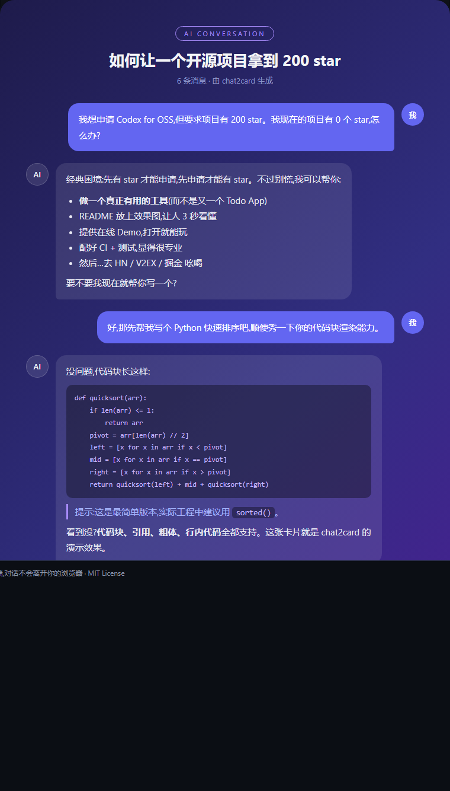
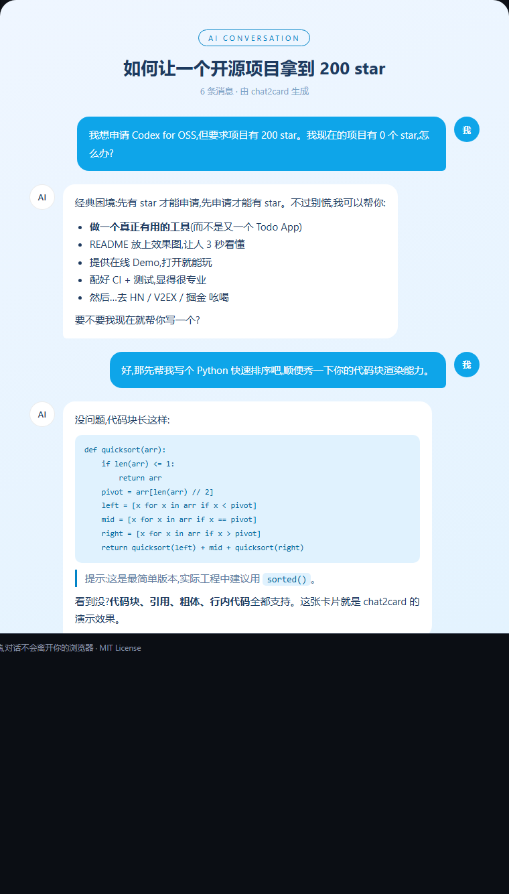

<div align="center">

# 🎴 chat2card

**把 AI 对话一键变成精美分享卡片 / Turn AI conversations into beautiful shareable cards**

卡片生成与导出在浏览器完成 · 仅解析公开分享链接时请求解析服务  
Card rendering and export stay client-side; the parser service is used only for public share-link imports

[](LICENSE)
[](https://github.com/cshouuu/chat2card/actions/workflows/ci.yml)
[](https://github.com/cshouuu/chat2card/pulls)

</div>

---

**中文**：粘贴 ChatGPT / Claude / DeepSeek / 豆包 / Gemini 的公开对话分享链接，或直接粘贴对话文本/JSON，实时预览并导出 PNG / 自包含 HTML / Markdown。分享链接解析会过滤 AI 的 thinking/reasoning，只保留用户消息和最终回复；公开图片/文件会尽可能保留到分享卡片中。

**English**: Paste a public ChatGPT / Claude / DeepSeek / Doubao / Gemini conversation link, or raw conversation text/JSON, then preview and export PNG / self-contained HTML / Markdown. Share-link import intentionally excludes model thinking/reasoning and preserves public image/file attachments when the provider exposes them.

---

## ✨ Features

- **No account required** — paste, preview, export.
- **Privacy-aware** — pasted text/JSON and card rendering/export stay in the browser. Public share-link import sends only the public URL to the parser service; some provider fallbacks use `r.jina.ai` to read the public page.
- **Thinking/reasoning excluded** — DeepSeek `thinking_content`, Doubao thinking blocks and ChatGPT reasoning-only messages are not rendered into cards.
- **Images and files** — normalized as attachments and rendered in the card, HTML export and Markdown export when publicly accessible.
- **Share link parsing**:

  | Platform | Supported share links | Status |
  |:---|:---|:---|
  | Claude | `claude.ai/share/…` | ✅ Supported; files hidden by Claude are shown as placeholders |
  | DeepSeek | `chat.deepseek.com/share/…` | ✅ Structured public-share parsing |
  | 豆包 / Doubao | `doubao.com/thread/…` | ✅ Structured public-share parsing |
  | ChatGPT | `chatgpt.com/share/…`, `chatgpt.com/s/…` | ✅ Turbo-stream parser + fallback |
  | Gemini | `gemini.google.com/share/…`, `share.gemini.google/…`, `g.co/gemini/share/…` | ✅ `ujx1Bf` public-share parser |

- **Multiple input formats**
  - Plain text with role prefixes: `用户:` / `ChatGPT:` / `System:`
  - ChatGPT official export JSON (`conversations.json`)
- **6 themes** — Aurora, Midnight, Terminal, Paper, Ocean, Sunset
- **Export in 3 formats** — PNG, self-contained HTML, Markdown
- **Lightweight Markdown rendering** — code blocks, lists, quotes, bold, inline code, links

## 🚀 Quick Start

### Frontend

```bash
git clone https://github.com/cshouuu/chat2card.git
cd chat2card
npm install
npm run dev
```

### Share parser service

The parser service uses Node 18+ built-in `fetch` and adds no runtime dependency.

```bash
npm run dev:parser
# http://localhost:8787
```

In development, the frontend automatically uses `http://localhost:8787`.

For a production frontend build:

```bash
VITE_PARSER_API=https://your-parser.example.com npm run build
```

The parser service accepts:

```http
POST /parse
Content-Type: application/json

{"url":"https://chatgpt.com/share/..."}
```

and returns the normalized `ParsedChat` shape:

```json
{
  "title": "Example",
  "messages": [
    { "role": "user", "content": "Hello" },
    {
      "role": "assistant",
      "content": "Hi",
      "attachments": [
        {
          "type": "image",
          "name": "example.png",
          "url": "https://example.com/example.png",
          "mimeType": "image/png"
        }
      ]
    }
  ],
  "source": "link"
}
```

### Provider adapters

- **ChatGPT**: decodes public React Router `streamController.enqueue(...)` turbo-stream data and reads `linear_conversation` / `messages`. A Jina raw-HTML route is available as a fallback for hosts that receive a 403 from ChatGPT.
- **Gemini**: resolves the public share id, calls the WIZ `batchexecute` RPC (`ujx1Bf`), decodes the `wrb.fr` envelope, and extracts public image attachment metadata.
- **DeepSeek**: reads the public share-content JSON endpoint and deliberately ignores `thinking_content`.
- **Doubao**: reads the public message snapshot, normalizes user/assistant blocks and deliberately ignores thinking fields.
- **Claude**: reads the public share through Jina Reader, strips page/tool UI metadata, and represents provider-hidden files as explicit placeholders.

The parser only accepts known HTTPS share hosts; it does not accept arbitrary proxy URLs or user cookies/session tokens.

## 🧪 Tests

```bash
npm test
node --test parser-service/parsers.test.mjs parser-service/providers/*.test.mjs
npm run build
```

CI runs frontend tests, parser-service tests, a production parser health check and the production TypeScript/Vite build.

## 🎨 Screenshots

| Aurora (dark) | Ocean (light) |
|:---:|:---:|
|  |  |

## 📖 Paste mode

Plain text remains the safest option for private or sensitive conversations because it never requires fetching a public share URL:

```text
用户: 帮我写一个 Python 快速排序
ChatGPT: 没问题，代码如下……
```

For ChatGPT official exports, paste one conversation object or the full `conversations.json` array.

## 🧱 Project Structure

```text
src/
├── core/
│   ├── parser.ts
│   ├── linkParser.ts
│   ├── chatgptShareParser.ts
│   ├── markdown.ts
│   └── export.ts
├── themes/
├── components/
└── samples.ts

parser-service/
├── parse-share.mjs
├── parsers.mjs
├── parsers.test.mjs
├── providers/
│   └── doubao.mjs
├── server.mjs
└── worker.mjs

api/
├── health.mjs
└── parse.mjs
```

## 🤝 Contributing

PRs welcome. Provider share formats are not public stable APIs, so real-world fixtures and regression reports are especially useful when a platform changes its public share page.

## 📄 License

[MIT](LICENSE) © chat2card contributors

---

<p align="center"><sub>Made with 💜 · If chat2card helps you, give it a ⭐!</sub></p>
